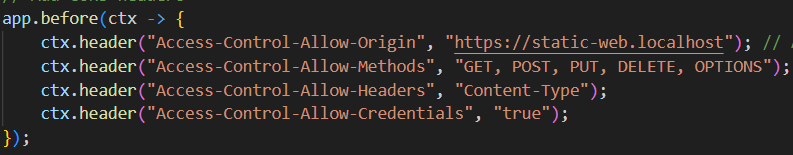
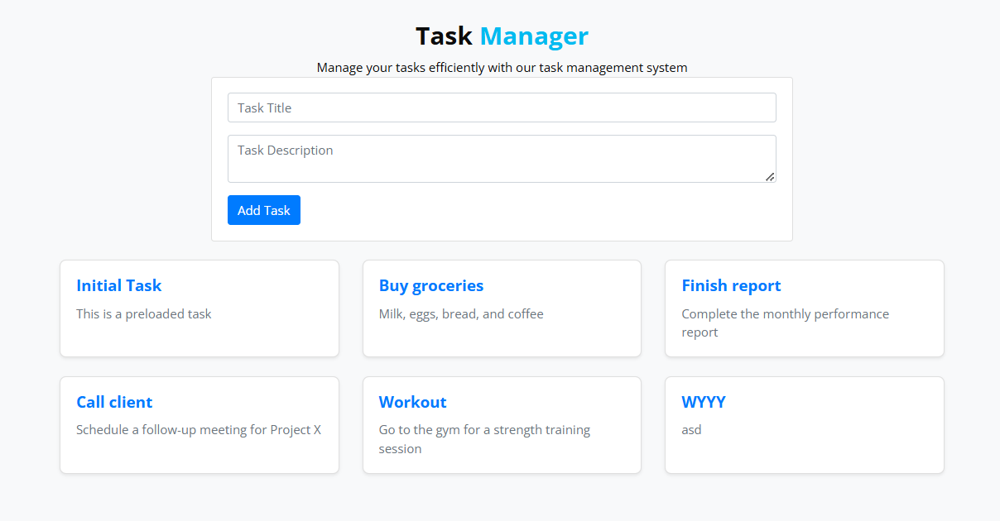

# Rapport
## Etape 1 Site Web statique

Création d'un dossier static-web-server contant:
- Le site static, modèle tiré de https://www.free-css.com/free-css-templates/page296/finexo.
- Un Dockerfile.
- Un fichier de configuration nginx.

Pour lancer le server dans docker il faut utiliser un terminal dans le dossier pour le serveur statique.
- Construire l'image Docker avec : "docker build -t static-nginx-server ."
- Lancer le conteneur sur le port 80 avec : docker run -d -p 8080:80 --name static-site static-nginx-server

Accès au serveur Web ce fait sur http://localhost:8080.

## Etape 2 Docker Compose

Ajout de Docker Compose dans le dossier *static-web-server" avec la configuration.

Construire l'image:
"docker compose build"

Démarrer l'infrastructure :
"docker compose up -d" //Cela lance le conteneur automatiquement et -d permet de lancer le conteneur en arrière-plan, sans afficher les logs directement dans le terminal.

Arrêter l'infrastructure :
"docker compose down"

## Etape 3 Serveur API HTTP

Objectif :
L’objectif de cette étape est de développer une API HTTP en utilisant Javalin afin de gérer une liste de tâches. L'API doit supporter les opérations CRUD :

- Création (POST),
- Récupération (GET),
- Mise à jour (PUT),
- Suppression (DELETE).

Structure du projet :

Main.java : Point d’entrée principal où le serveur Javalin est configuré pour exposer les routes API.
TaskController.java : Gère les opérations CRUD.
Task.java : Modèle de données pour les tâches.
pom.xml : Configuration Maven


Création de l'image dockerfile pour l'api\


Mis à jour du docker compose en ajoutant l'api au services\


Insomnia est l'outil utilisé pour tester la bonne fonctionnalité de l'api et du support des opérations CRUD. 

5 scénarios de test ont été imaginés pour couvrir les fonctionnalités suivantes :

1. POST /tasks : Création d'une nouvelle tâche.\
   Statut attendu : 201 Created

2. GET /tasks : Récupération de la liste complète des tâches.\
   Statut attendu : 200 OK

3. GET /tasks/{id} : Récupération d'une tâche spécifique par son ID.\
   Statut attendu : 200 OK (tâche trouvée) ou 404 Not Found (si l'ID est inexistant).

4. PUT /tasks/{id} : Mise à jour d'une tâche existante.\
   Statut attendu : 200 OK

5. DELETE /tasks/{id} : Suppression d'une tâche existante.\
   Statut attendu : 204 No Content

Résultats des tests :
1. **POST /tasks** :  \
   
2. **GET /tasks** :  \
   
3. **GET /tasks/{id}** :  \
   
4. **PUT /tasks/{id}** :  \
   
5. **DELETE /tasks/{id}** :  \
   

La tâche l'id 2 a été supprimé de la base de données

## Etape 4 Proxy inverse avec Traefik

Objectif:
L'objectif de cette étape est de déployer un proxy inverse configuré avec Traefik sur les différents services de l'application en utilisant Docker Compose.

Docker Compose:
Modification du docker compose pour integrer Traefik.
Définition trois services principaux :

1. Serveur statique (static-web)
Accès :
Traefik redirige les requêtes HTTP vers ce service via la règle définit dans le labels.
2. Serveur API (todolist-api)
Accès :
Traefik redirige les requêtes HTTP vers ce service via la règle définit dans le labels.
3. Traefik (Proxy inverse)
Traefik est utilisé pour rediriger les requêtes HTTP vers les bons services en fonction de l'URL demandée.

Ports configurés :
- 80:80 : Trafic HTTP redirigé web-static.
- 7000:7000 : Trafic HTTP redirigé todolist-api
- 8080:8080 : Accès au tableau de bord Traefik.


### Docker Compose pour Traefik 


Vérification:
La vérification du bon fonctionnement de l'API a été effectuée en utilisant Insomnia. En changeant simplement le nom de l'URL pour refléter la configuration Traefik (http://todolist-api.localhost)


Accès au site :
- Static : http://static-web.localhost/
- Api tasks : http://todolist-api.localhost/tasks
- Traefik dashboard : http://localhost:8080/

## Etape 5 Scalabilité et répartition de la charge
Objectif:
L'objectif de cette étape est de permettre à Traefik de détecter dynamiquement plusieurs instances des serveurs statiques et dynamiques, tout en vérifiant que la répartition de la charge s'effectue correctement entre les instances.

Configuration Docker Compose

Le fichier Docker Compose a été modifié pour inclure plusieurs réplicas de chaque service (statique et API) grâce à la clé deploy.replicas


### Ajout et Suppression Dynamique des Instances
1. Lancer les services avec les réplicas initialement configurés :\
   `docker-compose up -d`

Cela crée 3 instances pour static-web et todolist-api.

2. Ajouter des instances dynamiquement :\
`docker-compose up -d --scale static-web=5 --scale todolist-api=4`

Cette commande augmente le nombre d'instances pour les deux services sans redémarrer l'infrastructure.

3. Réduire dynamiquement les instances :\
`docker-compose up -d --scale static-web=2 --scale todolist-api=2`

Cela réduit le nombre d'instances en arrêtant les conteneurs inutilisés.

### Démonstration de la Répartition de Charge

Observation dans le tableau de bord Traefik :

Accédez à http://localhost:8080.

Dans la section Services, vous verrez les instances actives pour chaque service.

Traefik met à jour dynamiquement la liste des instances lorsque des réplicas sont ajoutés ou supprimés.

Consultez les logs pour vérifier quelle instance a traité chaque requête :\
   `docker logs -f reverse_proxy`


## Etape 6 Répartition de la charge avec round-robin et sessions persistantes

Objectif:
- Configurer et tester des sessions persistantes pour le service API.
- Maintenir le round-robin pour le service statique.

Configuration:
Ajout d'un labels dans le site de l'API pour créer des sessions persistantes\


Procédure de Validation:\
- Round-Robin :\
Vérification du routage avec les logs du reverse proxy. Envoie de plusieurs requêtes en ouvrant plusieurs pages du site static qui permet d'oberver une nouvelle adresse de routage à chaque reqêtes.\


- Sessions Persistantes :
Vérification du routage avec les logs du reverse proxy. Envoie de plusieurs requêtes avec Insomnia qui permet d'oberver une seule adresse de routage à chaque reqêtes.\


## Etape 7 - Configuration HTTPS avec Traefik

### Création du certificat et de la clé

Pour sécuriser l'infrastructure avec HTTPS, un certificat auto-signé a été généré à l'aide de `openssl`. Cela permet de chiffrer les communications entre les clients et le proxy inverse Traefik.

Les fichiers générés sont :
- **certificat.crt** : le certificat SSL.
- **key.key** : la clé privée associée au certificat.

Voici la commande utilisée pour générer ces fichiers dans le dossier `certificates` :

```bash
openssl req -newkey rsa:4096 -nodes -keyout ./certificates/key.key -x509 -out ./certificates/certificat.crt -days 365
```
Cela crée un certificat valide pendant 365 jours. Les fichiers ont ensuite été placés dans un dossier nommé `certificates`, qui est monté dans le conteneur Traefik.

### Modifications dans le fichier `docker-compose.yml`

Voici les principales modifications effectuées dans le fichier `docker-compose.yml` :Serveur statique (`static-web`) 
- Le service a été configuré pour utiliser HTTPS en ajoutant les labels : 
  - `traefik.http.routers.static-web.entrypoints=https` : Définit le point d'entrée HTTPS.
 
  - `traefik.http.routers.static-web.tls=true` : Active TLS (HTTPS) pour ce service.
Serveur API (`todolist-api`) 
- Le service a également été configuré pour utiliser HTTPS avec les labels : 
  - `traefik.http.routers.todolist-api.entrypoints=https` : Définit le point d'entrée HTTPS.
 
  - `traefik.http.routers.todolist-api.tls=true` : Active TLS (HTTPS) pour ce service.

### Traefik (Proxy inverse) 

Le service Traefik a été configuré avec plusieurs paramètres importants :
 
- Activation de l'API et du tableau de bord Traefik avec `--api.insecure=true`.
 
- Intégration avec Docker via `--providers.docker=true`.
 
- Définition des points d'entrée pour HTTP (`:80`) et HTTPS (`:443`) via les options `--entrypoints.web.address` et `--entrypoints.websecure.address`.
 
- Les certificats SSL sont montés dans le conteneur Traefik via le volume `./certificates:/etc/traefik/certificates`.
 
- La configuration TLS a été ajoutée dans le fichier `traefik.yaml` pour spécifier l'emplacement des certificats.


### Montage des volumes 

Les volumes suivants ont été montés dans le conteneur Traefik :
 
- `/var/run/docker.sock:/var/run/docker.sock` : Permet à Traefik d'interagir avec Docker.
 
- `./certificates:/etc/traefik/certificates` : Monte le dossier contenant les certificats SSL.
 
- `./traefik-access.log:/traefik-access.log` : Fichier de logs d'accès.
 
- `./traefik.yaml:/etc/traefik/traefik.yaml` : Fichier de configuration de Traefik.


## Étape Optionnelle 2 - Intégration API - Site Web Statique

### Objectif
L'objectif de cette étape était d'intégrer notre API REST avec le site web statique en utilisant JavaScript (AJAX). Cette intégration permet aux utilisateurs d'interagir avec la liste des tâches directement depuis l'interface web.

### Implémentation
1. **Ajout d'une nouvelle section dans le site statique**
   - Création d'une section "Task Manager" dans index.html
   - Intégration d'un formulaire pour ajouter des tâches
   - Mise en place d'une zone d'affichage des tâches existantes

2. **Configuration CORS dans docker-compose.yml**
   ```yaml
   todolist-api:
     labels:
       - "traefik.http.middlewares.cors.headers.accesscontrolallowmethods=GET,POST,PUT,DELETE,OPTIONS"
       - "traefik.http.middlewares.cors.headers.accesscontrolalloworiginlist=https://static-web.localhost"
       - "traefik.http.middlewares.cors.headers.accesscontrolallowheaders=*"
       - "traefik.http.middlewares.cors.headers.accesscontrolmaxage=100"
       - "traefik.http.middlewares.cors.headers.addvaryheader=true"
       - "traefik.http.routers.todolist-api.middlewares=cors@docker"
   ```

3. **Implémentation des fonctionnalités JavaScript**
   - Affichage des tâches existantes au chargement de la page
   - Ajout de nouvelles tâches via un formulaire
   - Modification des tâches existantes
   - Suppression des tâches
   - Gestion des erreurs et retours utilisateur

4. **Gestion des interactions API**
   - Utilisation de l'API Fetch pour les requêtes HTTP
   - Gestion des en-têtes CORS
   - Ajout des en-têtes Origin appropriés

   


### Fonctionnalités Implémentées
- **Lecture (GET)** : Affichage automatique des tâches au chargement de la page
- **Création (POST)** : Ajout de nouvelles tâches via le formulaire



### Problème
- **Replicas** : Lorsque le site statique envoie une nouvelle `task` à l’API seule une instance de l’API est mise à jour. Les autres restent inchangées.
Ainsi, quand le site rafraîchit les données, il peut récupérer des tâches incohérentes, mélangeant celles des instances mises à jour et des autres.

- **Solution** : Nous avons essayé d’utiliser les sticky sessions pour que le site communique toujours avec la même instance de l’API, mais cela n’a pas suffi.
- Une autre solution serait de mettre en place une base de données commune pour toutes les instances de l’API, afin de synchroniser les données.


