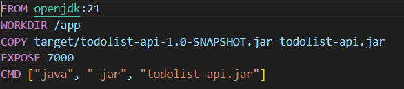
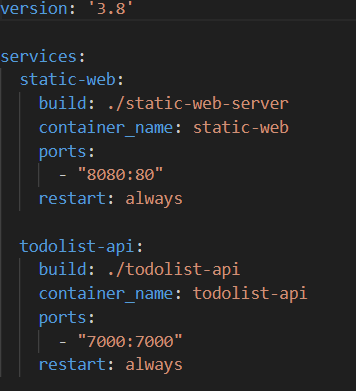
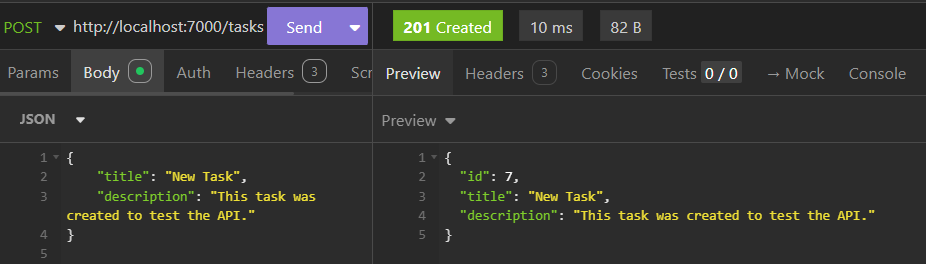
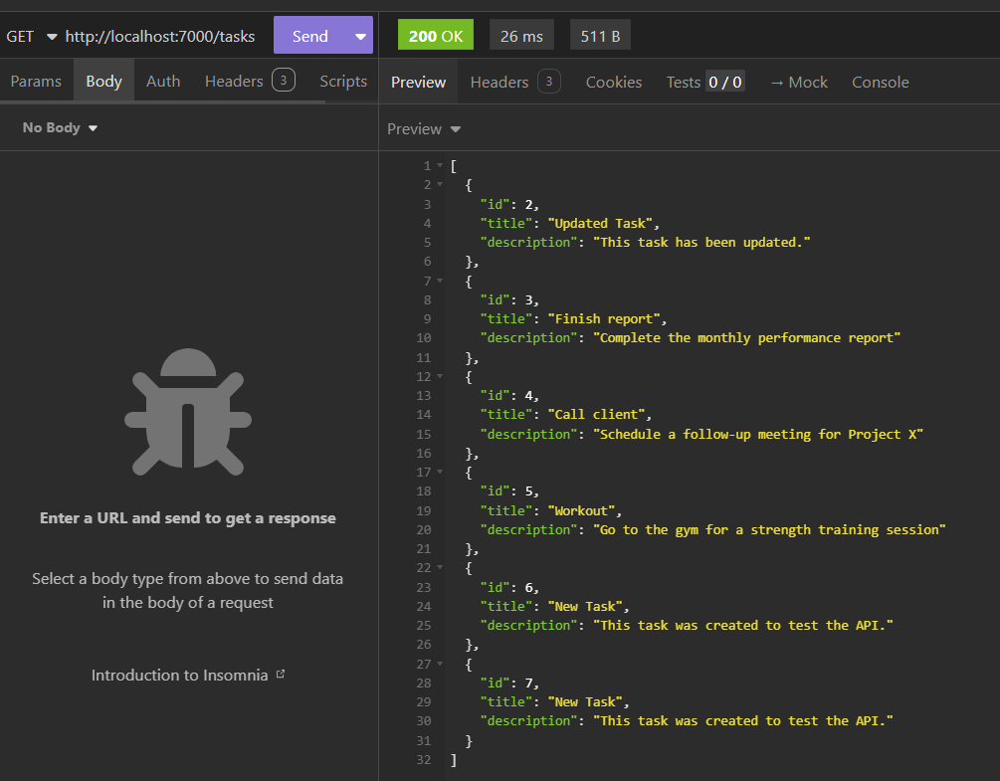
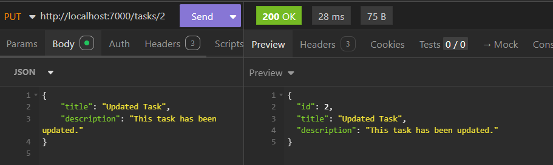
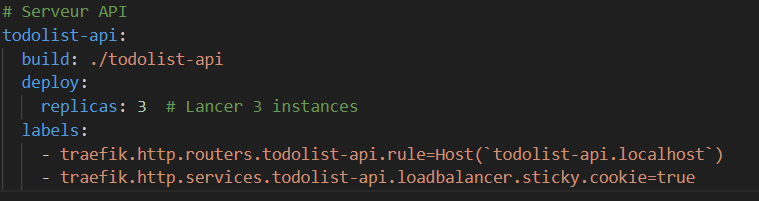
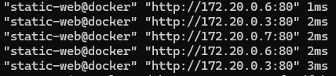
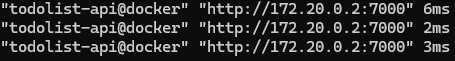

# Rapport
## Etape 1 Site Web statique

Création d'un dossier static-web-server contant:
- Le site static, modèle tiré de https://www.free-css.com/free-css-templates/page296/finexo.
- Un Dockerfile.
- Un fichier de configuration nginx.

Pour lancer le server dans docker il faut utiliser un terminal dans le dossier pour le serveur statique.
- Construire l'image Docker avec : "docker build -t static-nginx-server ."
- Lancer le conteneur sur le port 80 avec : docker run -d -p 8080:80 --name static-site static-nginx-server

Accès au serveur Web ce fait sur http://localhost:8080.

## Etape 2 Docker Compose

Ajout de Docker Compose dans le dossier *static-web-server" avec la configuration.

Construire l'image:
"docker compose build"

Démarrer l'infrastructure :
"docker compose up -d" //Cela lance le conteneur automatiquement et -d permet de lancer le conteneur en arrière-plan, sans afficher les logs directement dans le terminal.

Arrêter l'infrastructure :
"docker compose down"

## Etape 3 Serveur API HTTP

Objectif :
L’objectif de cette étape est de développer une API HTTP en utilisant Javalin afin de gérer une liste de tâches. L'API doit supporter les opérations CRUD :

- Création (POST),
- Récupération (GET),
- Mise à jour (PUT),
- Suppression (DELETE).

Structure du projet :

Main.java : Point d’entrée principal où le serveur Javalin est configuré pour exposer les routes API.
TaskController.java : Gère les opérations CRUD.
Task.java : Modèle de données pour les tâches.
pom.xml : Configuration Maven


Création de l'image dockerfile pour l'api\


Mis à jour du docker compose en ajoutant l'api au services\



Insomnia est l'outil utilisé pour tester la bonne fonctionnalité de l'api et du support des opérations CRUD. 

5 scénarios de test ont été imaginés pour couvrir les fonctionnalités suivantes :

1. POST /tasks : Création d'une nouvelle tâche.\
   Statut attendu : 201 Created

2. GET /tasks : Récupération de la liste complète des tâches.\
   Statut attendu : 200 OK

3. GET /tasks/{id} : Récupération d'une tâche spécifique par son ID.\
   Statut attendu : 200 OK (tâche trouvée) ou 404 Not Found (si l'ID est inexistant).

4. PUT /tasks/{id} : Mise à jour d'une tâche existante.\
   Statut attendu : 200 OK

5. DELETE /tasks/{id} : Suppression d'une tâche existante.\
   Statut attendu : 204 No Content

Résultats des tests :
1. **POST /tasks** :  \
   
2. **GET /tasks** :  \
   
3. **GET /tasks/{id}** :  \
   
4. **PUT /tasks/{id}** :  \
   
5. **DELETE /tasks/{id}** :  \
   

La tâche l'id 2 a été supprimé de la base de données

## Etape 4 Proxy inverse avec Traefik

Objectif:
L'objectif de cette étape est de déployer un proxy inverse configuré avec Traefik sur les différents services de l'application en utilisant Docker Compose.

Docker Compose:
Modification du docker compose pour integrer Traefik.
Définition trois services principaux :

1. Serveur statique (static-web)
Accès :
Traefik redirige les requêtes HTTP vers ce service via la règle définit dans le labels.
2. Serveur API (todolist-api)
Accès :
Traefik redirige les requêtes HTTP vers ce service via la règle définit dans le labels.
3. Traefik (Proxy inverse)
Traefik est utilisé pour rediriger les requêtes HTTP vers les bons services en fonction de l'URL demandée.

Ports configurés :
- 80:80 : Trafic HTTP redirigé web-static.
- 7000:7000 : Trafic HTTP redirigé todolist-api
- 8080:8080 : Accès au tableau de bord Traefik.


### Docker Compose pour Traefik 


Vérification:
La vérification du bon fonctionnement de l'API a été effectuée en utilisant Insomnia. En changeant simplement le nom de l'URL pour refléter la configuration Traefik (http://todolist-api.localhost)


Accès au site :
- Static : http://static-web.localhost/
- Api tasks : http://todolist-api.localhost/tasks
- Traefik dashboard : http://localhost:8080/

## Etape 5 Scalabilité et répartition de la charge
Objectif:
L'objectif de cette étape est de permettre à Traefik de détecter dynamiquement plusieurs instances des serveurs statiques et dynamiques, tout en vérifiant que la répartition de la charge s'effectue correctement entre les instances.

Configuration Docker Compose

Le fichier Docker Compose a été modifié pour inclure plusieurs réplicas de chaque service (statique et API) grâce à la clé deploy.replicas


### Ajout et Suppression Dynamique des Instances
1. Lancer les services avec les réplicas initialement configurés :\
   `docker-compose up -d`

Cela crée 3 instances pour static-web et todolist-api.

2. Ajouter des instances dynamiquement :\
`docker-compose up -d --scale static-web=5 --scale todolist-api=4`

Cette commande augmente le nombre d'instances pour les deux services sans redémarrer l'infrastructure.

3. Réduire dynamiquement les instances :\
`docker-compose up -d --scale static-web=2 --scale todolist-api=2`

Cela réduit le nombre d'instances en arrêtant les conteneurs inutilisés.

### Démonstration de la Répartition de Charge

Observation dans le tableau de bord Traefik :

Accédez à http://localhost:8080.

Dans la section Services, vous verrez les instances actives pour chaque service.

Traefik met à jour dynamiquement la liste des instances lorsque des réplicas sont ajoutés ou supprimés.

Consultez les logs pour vérifier quelle instance a traité chaque requête :\
   `docker logs -f reverse_proxy`


## Etape 6 Répartition de la charge avec round-robin et sessions persistantes

Objectif:
- Configurer et tester des sessions persistantes pour le service API.
- Maintenir le round-robin pour le service statique.

Configuration:
Ajout d'un labels dans le site de l'API pour créer des sessions persistantes\


Procédure de Validation:\
- Round-Robin :\
Vérification du routage avec les logs du reverse proxy. Envoie de plusieurs requêtes en ouvrant plusieurs pages du site static qui permet d'oberver une nouvelle adresse de routage à chaque reqêtes.\


- Sessions Persistantes :
Vérification du routage avec les logs du reverse proxy. Envoie de plusieurs requêtes avec Insomnia qui permet d'oberver une seule adresse de routage à chaque reqêtes.\


## Etape 7 - Configuration HTTPS avec Traefik

### Création du certificat et de la clé

Pour sécuriser l'infrastructure avec HTTPS, un certificat auto-signé a été généré à l'aide de `openssl`. Cela permet de chiffrer les communications entre les clients et le proxy inverse Traefik.

Les fichiers générés sont :
- **certificat.crt** : le certificat SSL.
- **key.key** : la clé privée associée au certificat.

Voici la commande utilisée pour générer ces fichiers dans le dossier `certificates` :

```bash
openssl req -newkey rsa:4096 -nodes -keyout ./certificates/key.key -x509 -out ./certificates/certificat.crt -days 365
```
Cela crée un certificat valide pendant 365 jours. Les fichiers ont ensuite été placés dans un dossier nommé `certificates`, qui est monté dans le conteneur Traefik.

### Modifications dans le fichier `docker-compose.yml`

Voici les principales modifications effectuées dans le fichier `docker-compose.yml` :Serveur statique (`static-web`) 
- Le service a été configuré pour utiliser HTTPS en ajoutant les labels : 
  - `traefik.http.routers.static-web.entrypoints=https` : Définit le point d'entrée HTTPS.
 
  - `traefik.http.routers.static-web.tls=true` : Active TLS (HTTPS) pour ce service.
Serveur API (`todolist-api`) 
- Le service a également été configuré pour utiliser HTTPS avec les labels : 
  - `traefik.http.routers.todolist-api.entrypoints=https` : Définit le point d'entrée HTTPS.
 
  - `traefik.http.routers.todolist-api.tls=true` : Active TLS (HTTPS) pour ce service.

### Traefik (Proxy inverse) 

Le service Traefik a été configuré avec plusieurs paramètres importants :
 
- Activation de l'API et du tableau de bord Traefik avec `--api.insecure=true`.
 
- Intégration avec Docker via `--providers.docker=true`.
 
- Définition des points d'entrée pour HTTP (`:80`) et HTTPS (`:443`) via les options `--entrypoints.web.address` et `--entrypoints.websecure.address`.
 
- Les certificats SSL sont montés dans le conteneur Traefik via le volume `./certificates:/etc/traefik/certificates`.
 
- La configuration TLS a été ajoutée dans le fichier `traefik.yaml` pour spécifier l'emplacement des certificats.


### Montage des volumes 

Les volumes suivants ont été montés dans le conteneur Traefik :
 
- `/var/run/docker.sock:/var/run/docker.sock` : Permet à Traefik d'interagir avec Docker.
 
- `./certificates:/etc/traefik/certificates` : Monte le dossier contenant les certificats SSL.
 
- `./traefik-access.log:/traefik-access.log` : Fichier de logs d'accès.
 
- `./traefik.yaml:/etc/traefik/traefik.yaml` : Fichier de configuration de Traefik.


# Objectifs

L'objectif principal de ce TP est d'apprendre à construire une infrastructure Web complète. Cela signifie que nous allons mettre en place une infrastructure serveur qui servira un site Web statique et une API HTTP dynamique. Le diagramme ci-dessous montre l'architecture de l'infrastructure que nous allons créer.

En plus de la nécessité de servir du contenu statique et dynamique, l'infrastructure aura les caractéristiques suivantes :

- **Scalabilité** : tant le serveur statique que le serveur dynamique seront déployés en tant que clusters de plusieurs instances. Le proxy inverse sera configuré pour répartir la charge entre les instances.
- **Sécurité** : la connexion entre le navigateur et le proxy inverse sera chiffrée via HTTPS.
- **Gestion** : une application Web sera déployée pour gérer l'infrastructure. Cette application permettra de démarrer/arrêter des instances de serveurs et de surveiller l'état de l'infrastructure.

## Instructions générales

C'est un grand TP et vous aurez besoin de beaucoup de temps pour le terminer.  
Vous travaillerez en binôme et utiliserez un workflow Git pour collaborer.  
Pour certaines étapes, vous devrez faire des recherches dans la documentation par vous-même (nous sommes là pour vous aider, mais nous ne vous donnerons pas des instructions pas à pas !) ou faire preuve de créativité (ne vous attendez pas à des lignes directrices complètes).  
Lisez attentivement les critères d'acceptation de chaque étape. Ils vous diront ce que vous devez faire pour compléter l'étape.  
Après le TP, chaque groupe fera une courte démo de son infrastructure.  
Vous devez rédiger un rapport avec une courte description pour chaque étape. Faites-le directement dans le dépôt, dans un ou plusieurs fichiers markdown. Commencez par le fichier README.md à la racine de votre répertoire.  
Le rapport doit contenir la procédure que vous avez suivie pour prouver que votre configuration est correcte (ce que vous avez fait pour que l'étape fonctionne et ce que vous feriez si vous faisiez une démo).

---

## Étape 0 : Dépôt GitHub

Créez un dépôt GitHub pour votre projet. Vous utiliserez ce dépôt pour collaborer avec votre coéquipier. Vous l'utiliserez aussi pour soumettre votre travail.

### Important

Soyez attentif à garder une structure claire du dépôt afin que les différents composants soient bien séparés.

### Critères d'acceptation
- Vous avez créé un dépôt GitHub pour votre projet.
- Le dépôt contient un fichier Readme que vous utiliserez pour documenter votre projet.

---

## Étape 1 : Site Web statique

L'objectif de cette étape est de construire une image Docker qui contient un serveur HTTP statique Nginx. Le serveur servira un site Web statique. Ce site Web sera une seule page avec un modèle attrayant. Vous pouvez utiliser un modèle gratuit par exemple sur Free-CSS ou Start Bootstrap.

### Critères d'acceptation
- Vous avez créé un dossier séparé dans votre dépôt pour votre serveur Web statique.
- Vous avez un Dockerfile basé sur l'image Nginx. Le Dockerfile copie le contenu du site statique dans l'image.
- Vous avez configuré le fichier nginx.conf pour servir le contenu statique sur un port (généralement 80).
- Vous êtes capable d'expliquer le contenu du fichier nginx.conf.
- Vous pouvez lancer l'image et accéder au contenu statique depuis un navigateur.
- Vous avez documenté votre configuration dans votre rapport.

---

## Étape 2 : Docker Compose

L'objectif de cette étape est d'utiliser Docker Compose pour déployer une première version de l'infrastructure avec un seul service : le serveur Web statique.

En plus de la configuration Docker Compose de base, nous voulons pouvoir reconstruire l'image Docker du serveur Web. Consultez la documentation Docker Compose Build pour cette partie.

### Critères d'acceptation
- Vous avez ajouté un fichier de configuration Docker Compose à votre dépôt GitHub.
- Vous pouvez démarrer et arrêter une infrastructure avec un serveur Web statique via Docker Compose.
- Vous pouvez accéder au serveur Web sur votre machine locale sur le port respectif.
- Vous pouvez reconstruire l'image Docker avec `docker compose build`.
- Vous avez documenté votre configuration dans votre rapport.

---

## Étape 3 : Serveur API HTTP

Cette étape nécessite plus de travail. L'objectif est de construire une API HTTP avec Javalin. Vous pouvez implémenter n'importe quelle API de votre choix, par exemple :

- une API pour gérer une liste de citations du jour
- une API pour gérer une liste de tâches
- une API pour gérer une liste de personnes

Utilisez votre imagination et soyez créatif !  
La seule exigence est que l'API supporte toutes les opérations CRUD, c'est-à-dire : Créer, Lire, Mettre à jour, Supprimer.

Utilisez un outil de test d'API comme Insomnia, Hoppscotch ou Bruno pour tester toutes ces opérations.

Le serveur n'a pas besoin d'utiliser une base de données. Vous pouvez stocker les données en mémoire. Mais si vous souhaitez ajouter une base de données, n'hésitez pas à le faire.

Une fois l'implémentation terminée, créez un Dockerfile pour le serveur API. Ajoutez-le ensuite en tant que service dans votre configuration Docker Compose.

### Critères d'acceptation
- Votre API supporte toutes les opérations CRUD.
- Vous êtes capable d'expliquer votre implémentation et de parcourir le code.
- Vous pouvez démarrer et arrêter le serveur API avec Docker Compose.
- Vous pouvez accéder à la fois à l'API et au serveur statique depuis votre navigateur.
- Vous pouvez reconstruire l'image Docker avec Docker Compose.
- Vous pouvez faire une démo où vous utilisez un outil de test d'API pour montrer que toutes les opérations CRUD fonctionnent.
- Vous avez documenté votre implémentation dans votre rapport.

---

## Étape 4 : Proxy inverse avec Traefik

L'objectif de cette étape est de placer un proxy inverse devant les serveurs Web dynamiques et statiques de manière à ce que le proxy inverse reçoive toutes les connexions et les relaie vers les serveurs Web respectifs.

Vous utiliserez Traefik comme proxy inverse. Traefik interagit directement avec Docker pour obtenir la liste des serveurs backend actifs. Cela signifie qu'il peut s'ajuster dynamiquement au nombre de serveurs en cours d'exécution. Traefik a la particularité qu'il peut être configuré à l'aide d'étiquettes dans le fichier Docker Compose. Cela signifie que vous n'avez pas besoin d'écrire un fichier de configuration pour Traefik, mais que Traefik lira les configurations des conteneurs à partir du moteur Docker via le fichier `/var/run/docker.sock`.

Les étapes à suivre pour cette section sont donc :

1. Ajouter un nouveau service "reverse_proxy" dans votre fichier Docker Compose en utilisant l'image Docker Traefik.
2. Lire la documentation Quick Start de Traefik pour établir la configuration de base.
3. Lire la documentation Traefik & Docker pour apprendre à configurer Traefik pour fonctionner avec Docker.
4. Implémenter le proxy inverse :
   - Relayer les requêtes arrivant sur "localhost" vers le serveur HTTP statique.
   - Relayer les requêtes arrivant sur "localhost/api" vers le serveur API. Consultez la documentation des routeurs Traefik pour gérer les routes basées sur des préfixes de chemins.
5. Vous devrez supprimer la configuration des ports dans le serveur statique et dynamique dans le fichier Docker Compose et les remplacer par une configuration `expose`. Traefik pourra alors accéder aux serveurs via le réseau interne de Docker.
6. Vous pouvez utiliser le tableau de bord de Traefik pour surveiller l'état du proxy inverse.

### Critères d'acceptation
- Vous pouvez faire une démo où vous partez d'un environnement Docker "vide" (aucun conteneur en cours d'exécution) et, à l'aide de Docker Compose, vous pouvez démarrer votre infrastructure avec 3 conteneurs : serveur statique, serveur dynamique et proxy inverse.
- Dans la démo, vous pouvez accéder à chaque serveur depuis le navigateur. Vous pouvez prouver que le routage est effectué correctement par le proxy inverse.
- Vous êtes capable d'expliquer comment vous avez implémenté la solution et de parcourir la configuration et le code.
- Vous êtes capable d'expliquer pourquoi un proxy inverse est utile pour améliorer la sécurité de l'infrastructure.
- Vous êtes capable d'expliquer comment accéder au tableau de bord de Traefik et comment il fonctionne.
- Vous avez documenté votre configuration dans votre rapport.

---

## Étape 5 : Scalabilité et répartition de la charge

L'objectif de cette section est de permettre à Traefik de détecter dynamiquement plusieurs instances des serveurs (dynamiques/statique). Vous avez peut-être déjà fait cela à l'étape 3.

Modifiez votre fichier Docker Compose de manière à ce que plusieurs instances de chaque serveur soient lancées. Vérifiez que le proxy inverse répartit les connexions entre les différentes instances. Ensuite, trouvez un moyen de mettre à jour dynamiquement le nombre d'instances de chaque service avec Docker Compose, sans avoir à arrêter et redémarrer la topologie.

### Critères d'acceptation
- Vous pouvez utiliser Docker Compose pour démarrer l'infrastructure avec plusieurs instances de chaque serveur (statique et dynamique).
- Vous pouvez ajouter et supprimer dynamiquement des instances de chaque serveur.
- Vous pouvez faire une démo pour montrer que Traefik effectue la répartition de la charge entre les instances.
- Si vous ajoutez ou supprimez des instances, vous pouvez montrer que le répartiteur de charge est mis à jour dynamiquement pour utiliser les instances disponibles.
- Vous avez documenté votre configuration dans votre rapport.

---

## Étape 6 : Répartition de la charge avec round-robin et sessions persistantes

Par défaut, Traefik utilise un round-robin pour répartir la charge entre toutes les instances disponibles. Cependant, si un service est avec état, il serait préférable d'envoyer les requêtes de la même session toujours vers la même instance. C'est ce qu'on appelle les sessions persistantes.

L'objectif de cette étape est de modifier la configuration de manière à ce que :

- Traefik utilise des sessions persistantes pour les instances du serveur dynamique (service API).
- Traefik continue à utiliser le round-robin pour les serveurs statiques (aucun changement requis).

### Critères d'acceptation
- Vous avez une configuration pour démontrer la notion de session persistante.
- Vous prouvez que votre répartiteur de charge peut répartir les requêtes HTTP de manière round-robin vers les nœuds du serveur statique (car il n'y a pas d'état).
- Vous prouvez que votre répartiteur de charge peut gérer les sessions persistantes lors du transfert des requêtes HTTP vers les nœuds du serveur dynamique.
- Vous avez documenté votre configuration et votre procédure de validation dans votre rapport.

---

## Étape 7 : Sécurisation de Traefik avec HTTPS

Toute infrastructure Web réelle doit être sécurisée avec HTTPS au lieu du HTTP en clair. L'objectif de cette étape est de configurer Traefik pour utiliser HTTPS avec les clients. Le schéma ci-dessous montre l'architecture.

Cela signifie que HTTPS est utilisé pour la connexion avec les clients, via Internet. À l'intérieur de l'infrastructure, les connexions entre le proxy inverse et les serveurs se font toujours en HTTP en clair.

### Certificat
Pour ce faire, vous devrez d'abord générer un certificat de chiffrement. Étant donné que le système n'est pas exposé à Internet, vous ne pouvez pas utiliser un certificat public comme Let's Encrypt, mais devez générer un certificat auto-signé. Vous pouvez le faire en utilisant `openssl`.

Une fois que vous avez les deux fichiers (certificat et clé), vous pouvez les placer dans un dossier qui doit être monté en tant que volume dans le conteneur Traefik. Vous pouvez monter ce volume à n'importe quel chemin dans le conteneur, par exemple `/etc/traefik/certificates`.

### Fichier de configuration Traefik
Jusqu'à présent, vous avez configuré Traefik via des étiquettes directement dans le fichier Docker Compose. Cependant, il n'est pas possible de spécifier l'emplacement des certificats à Traefik avec des étiquettes. Vous devez créer un fichier de configuration `traefik.yaml`.

Encore une fois, vous devrez monter ce fichier dans le conteneur Traefik en tant que volume, à l'emplacement `/etc/traefik/traefik.yaml`.

Le fichier de configuration doit contenir plusieurs sections :

- La section `providers` pour configurer Traefik afin qu'il lise la configuration depuis Docker.
- La section `entrypoints` pour configurer deux points d'entrée : http et https.
- La section `tls` pour configurer les certificats TLS. Indiquez l'emplacement des certificats comme le chemin où vous avez monté le répertoire dans le conteneur (par exemple `/etc/traefik/certificates`).
- Pour rendre le tableau de bord accessible, vous devez configurer la section `api`. Vous pouvez supprimer les étiquettes respectives du fichier Docker Compose.

### Activation du point d'entrée HTTPS pour les serveurs
Enfin, vous devez activer HTTPS pour les serveurs statique et dynamique. Cela se fait dans le fichier Docker Compose. Vous devez ajouter deux étiquettes à chaque serveur :

- pour activer le point d'entrée HTTPS,
- pour définir TLS sur `true`.

Consultez la documentation Traefik pour Docker pour ces deux étiquettes.

### Test
Après ces configurations, il devrait être possible d'accéder aux serveurs statiques et dynamiques via HTTPS. Le navigateur se plaindra que les sites ne sont pas sécurisés, puisque le certificat est auto-signé. Mais vous pouvez ignorer cet avertissement.

Si cela ne fonctionne pas, allez sur le tableau de bord Traefik et vérifiez la configuration des routeurs et des points d'entrée.

### Critères d'acceptation
- Vous pouvez faire une démo où l'accès au proxy inverse se fait en HTTPS.
- Vous pouvez expliquer la configuration de Traefik avec HTTPS.
- Vous êtes capable d'expliquer le rôle des certificats et pourquoi nous utilisons un certificat auto-signé dans cet environnement.
- Vous avez documenté votre configuration dans votre rapport.
